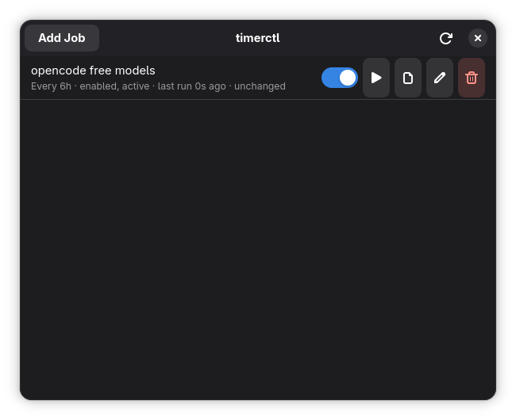
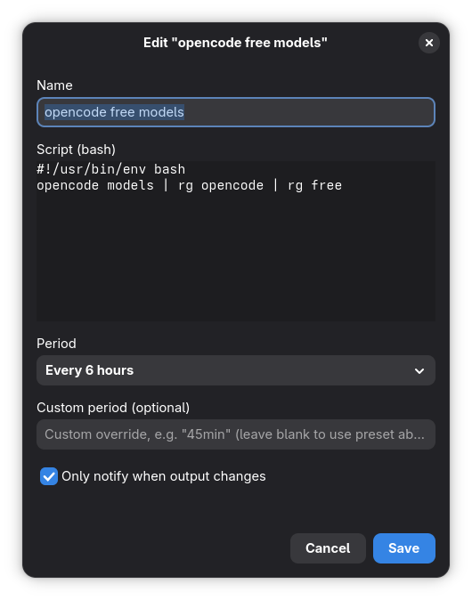

# timerctl

A small GTK4 desktop app that wraps `systemctl --user` timers. Instead of hand-writing unit files, add a job through the GUI — a name, a bash script, a period, and whether to notify only when the output changes — and timerctl generates and manages the systemd units for you.

The app is just a control panel. Once a job is created, it runs on its own schedule via systemd whether or not the GUI is open; timerctl only reads/writes unit files and talks to `systemctl --user`.





## Features

- Add / edit / delete jobs, each backed by a real `systemd --user` timer + oneshot service
- Enable/disable a job's timer without touching its script or run history
- Run a job on demand
- View a job's last captured output and when it last ran
- Optional "only notify when output changes" mode — diffs each run against the previous one and skips the `notify-send` popup when nothing changed
- Preset periods (15m / 30m / 1h / 6h / 12h / 1d) plus a free-text override validated with `systemd-analyze timespan`

## Requirements

- [Deno](https://deno.com/) 2.x
- GTK4 (`libgtk-4.so.1`) and libadwaita (`libadwaita-1.so.0`)
- `systemctl`, `systemd-analyze`, and `notify-send` on `PATH`

## Running

```sh
deno task dev
```

which runs:

```sh
deno run --allow-ffi --allow-run=systemctl,systemd-analyze --allow-read --allow-write --allow-env main.ts
```

## Headless CLI

`bin/timerctl-cli.ts` drives the same job logic without GTK — handy for scripting or debugging a job without opening the app:

```sh
deno task cli create --name "opencode free models" --script 'opencode models | rg opencode | rg free' --period 6h --notify-on-change
deno task cli list
deno task cli run <slug>
deno task cli enable <slug>
deno task cli disable <slug>
deno task cli log <slug>
deno task cli delete <slug>
```

## How it works

- **Unit generation** (`src/systemdUnits.ts`): each job gets `~/.config/systemd/user/timerctl-<slug>.service` (`Type=oneshot`, calls the shared wrapper script) and `timerctl-<slug>.timer` (`OnUnitActiveSec=<period>`, `Persistent=true`).
- **Wrapper script** (`~/.local/share/timerctl/wrapper.sh`, templated from `src/wrapperScript.ts`): runs the job's script, diffs the output against the previous run, writes the new output + a `changed:true|false` timestamp, and calls `notify-send` (skipped if the mode is "only on change" and nothing changed).
- **Job registry** (`~/.local/share/timerctl/{scripts,jobs,state}/`): the authoritative source of which jobs exist and their config — the GUI never scans systemd for jobs it doesn't already know about. Live enabled/active state is read from `systemctl --user show` on refresh.
- **Slugs** are generated once at creation and never change, even if you rename the job later.

## Project layout

```
main.ts                  entry point (Application + EventLoop + main window)
src/paths.ts              filesystem/unit-path constants
src/slug.ts                slug generation + collision handling
src/period.ts               period presets + systemd-analyze validation
src/systemctl.ts              systemctl --user wrapper
src/systemdUnits.ts            unit-file rendering/writing/removal
src/wrapperScript.ts            the notify/diff wrapper script template
src/jobRegistry.ts               job metadata/script/state file I/O
src/jobService.ts                  create/update/delete/run/enable/disable orchestration
src/ui/mainWindow.ts               job list window
src/ui/jobDialog.ts                 add/edit job dialog
src/ui/confirmDialog.ts              delete confirmation + error dialogs
src/ui/logView.ts                    last-output viewer
bin/timerctl-cli.ts                headless CLI over the same job logic
```

## Notes

- Deleting a job stops and disables its timer, removes both unit files, removes systemd's `Persistent=true` stamp file, and removes the job's script/config/history — nothing is left behind.
- Built with [`@sigmasd/gtk`](https://jsr.io/@sigmasd/gtk), a Deno FFI binding for GTK4 + libadwaita.
